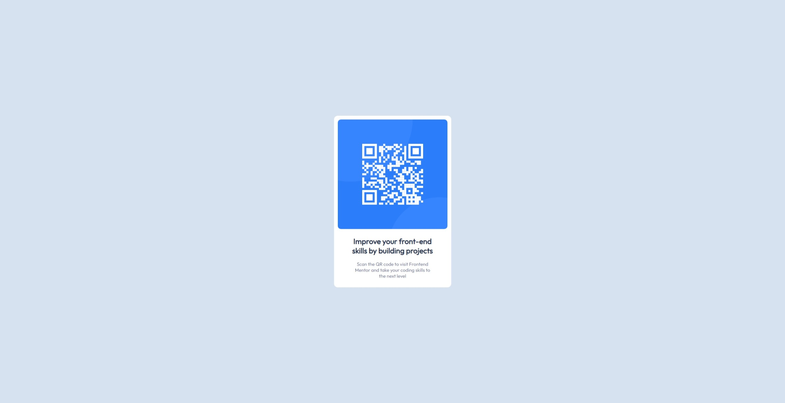

# Frontend Mentor - QR code component solution

This is a solution to the [QR code component challenge on Frontend Mentor](https://www.frontendmentor.io/challenges/qr-code-component-iux_sIO_H). Frontend Mentor challenges help you improve your coding skills by building realistic projects. 

## Table of contents

- [Overview](#overview)
  - [Screenshot](#screenshot)
  - [Links](#links)
- [My process](#my-process)
  - [Built with](#built-with)
  - [What I learned](#what-i-learned)
  - [Continued development](#continued-development)

## Overview

### Screenshot




### Links

- Solution URL: https://github.com/xirb22/qr-code-component-main
- Live Site URL: https://xirb22.github.io/qr-code-component-main/

## My process

### Built with

Basic HTML and CSS

### What I learned

This project was a great way to get started with front-end web development. It was a fun way to put my very basic html/css skills to practice. Some things I learned doing this project:

- Using the @import statement for using external fonts
```css
@import url('https://fonts.googleapis.com/css2?family=Outfit&display=swap');
```

- Thinking about layout and using wrapper-classes to achieve a desired layout.
```html
  <div class="card-wrapper">

    

    <div class="text-wrapper">

      <h2>Improve your front-end skills by building projects</h2>

      <p>Scan the QR code to visit Frontend Mentor and take your coding skills to the next level</p>

    </div>

  </div>
```

- Using Git again (it's been a long time) and using Github and Github Pages.


### Continued development

- I'm still not too confident at positioning elements on the webpage using padding and margin. I think this is why I should start to learn about grid and flexbox in the near future.

